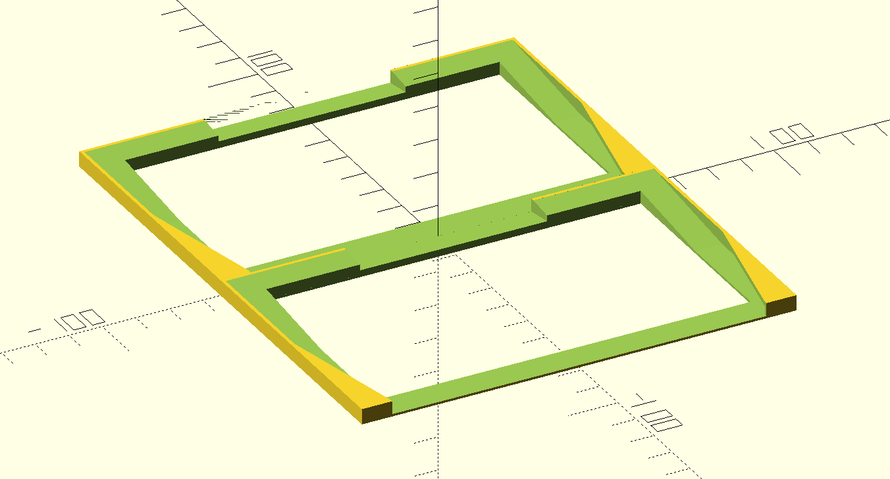
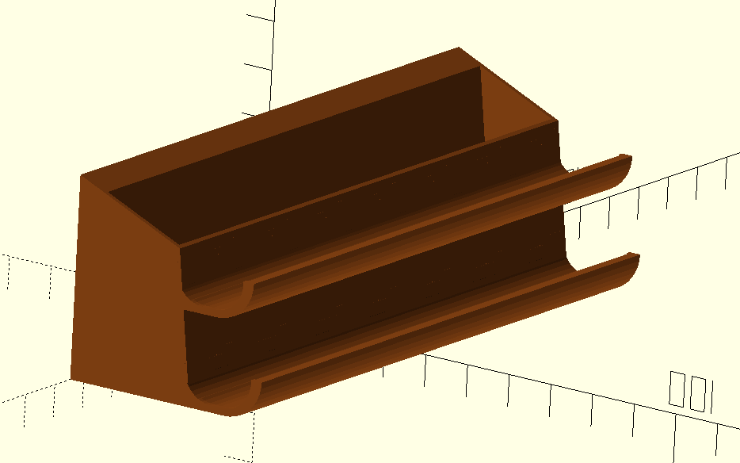
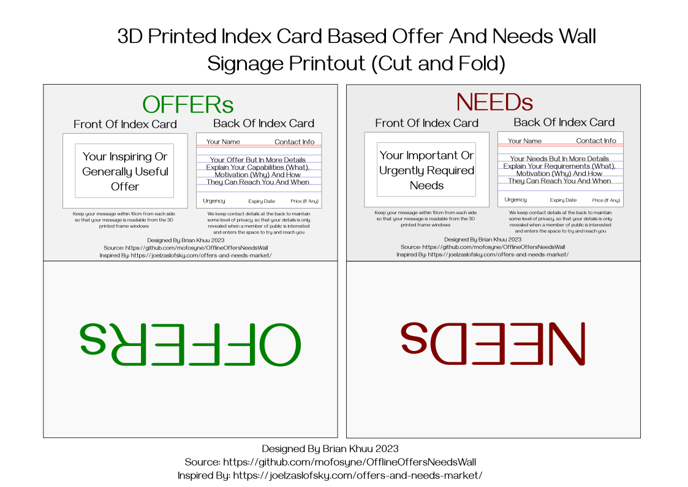
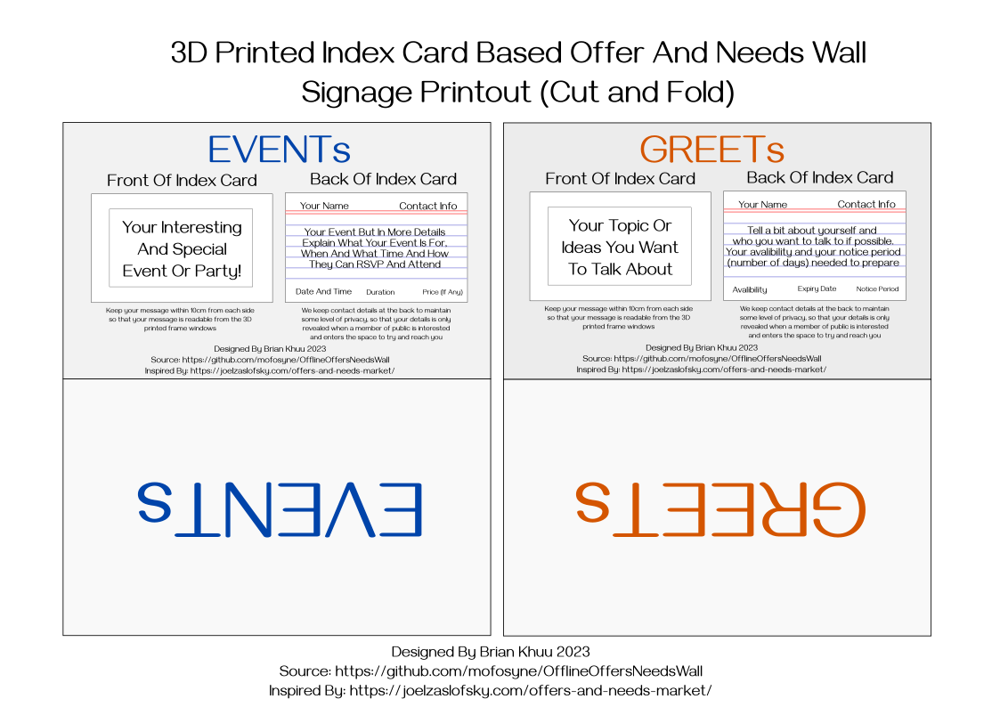

# OfflineOffersNeedsWall 3D Printed Index Frame Project

Welcome to the OfflineOffersNeedsWall project, a set of 3D-printed components designed to facilitate an offline index card-based offers and needs wall. 

This project aims to provide an easy way to promote collaboration, community engagement, and mutual support in local cafes and community spaces by providing a tangible platform for individuals to share their needs, offers, events, and ideas.

## 3D Printed Components:

### 1. wallMountedSingleCardHolder_IndexCard.stl

- **Description:** A single card slot holder designed to securely hold index cards.
- **Printing Details:**
    - Layer Height: 0.20mm
    - Support: No support required
    - Additional Notes: Ideal for displaying individual index cards, ensuring visibility and accessibility.

### 2. wallMountedIndexCardHolder.stl

- **Description:** A multifunctional holder designed to accommodate both index cards and a pen.
- **Usage:** Enables users to display index cards while conveniently storing a pen for additional information or updates.
- **Printing Details:** 
    - Layer Height: [Specify the recommended layer height]
    - Support: [Specify if support is required]
    - Additional Notes: Combines functionality and efficiency, optimizing space and accessibility.

## Print/Cut/Fold Signage:

These signage are index card sized and is slotted into the top of each index card colum slots.

### 1. needsOfferSignagePrintout.pdf

- **Needs Section:**
    - **Description:** A guide to help individuals articulate their needs effectively.
    - **Details:** Encourages users to specify their urgent or essential needs, provide detailed explanations (What, Why), and outline contact information and availability.

- **Offer Section:**
    - **Description:** A template to inspire individuals to share their skills, resources, or services.
    - **Details:** Encourages users to highlight their offers, skills, or contributions, fostering collaboration and mutual support within the community.

### 2. eventsSignage.pdf

- **Events Section:**
    - **Description:** A guide to help individuals promote their events or gatherings.
    - **Details:** Enables users to provide essential details about their events, including purpose, date, time, and RSVP information, fostering community engagement and participation.

- **Meets Section:**
    - **Description:** A platform for individuals to share their interests, topics, or ideas for discussion.
    - **Details:** Encourages users to introduce themselves, outline their interests or topics of discussion, and specify their availability, fostering connections and meaningful conversations within the community.
